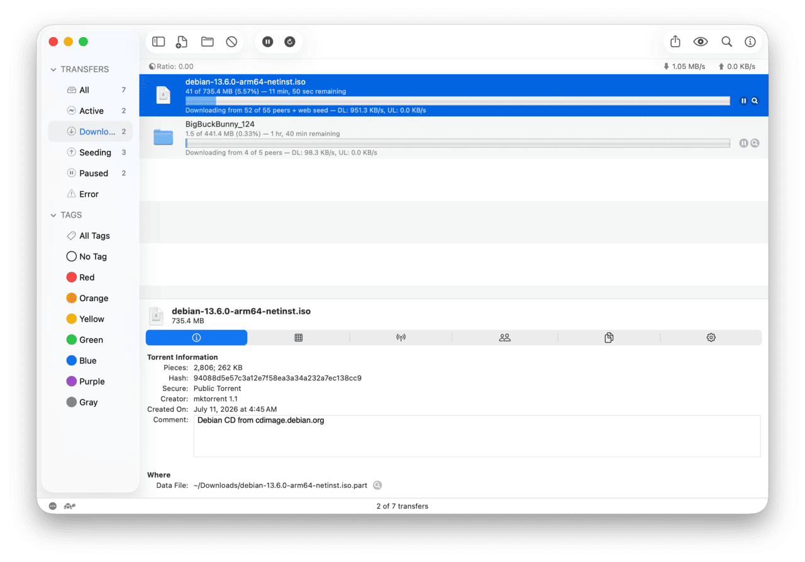
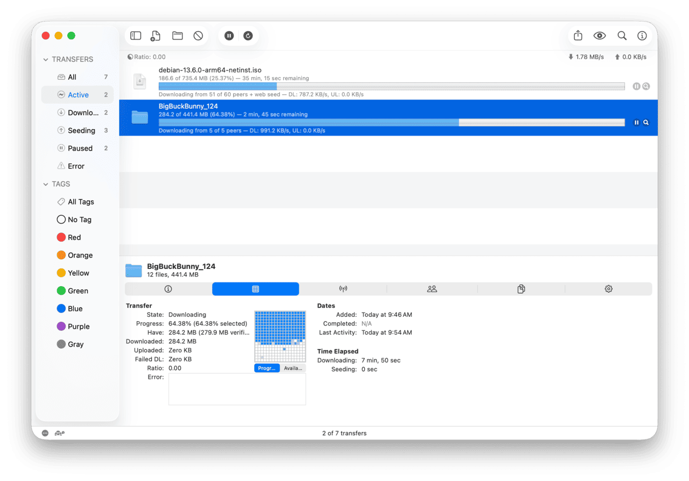

# uTransmission

A fork of [Transmission](https://github.com/transmission/transmission) that rebuilds
the desktop client around a single window: a sidebar for filters and tags, and the
torrent inspector docked inside the window instead of floating in one of its own.



*Filters and tags on the left, the inspector docked along the bottom — one window
instead of three.*



*The inspector keeps all six tabs, including the piece map, and takes only the height
its content needs.*

macOS is the primary target. The same three features — sidebar, docked inspector and
sequential download — are also ported to the Qt client, which is what runs on Windows;
see [`docs/uTransmission-on-Windows.md`](docs/uTransmission-on-Windows.md).

Everything else is upstream Transmission. The BitTorrent engine, the GTK client, the
daemon and the web UI are untouched, and the engine itself gains only seventeen lines
that expose a mode the core already had.

## Why

Transmission's macOS client keeps navigation in a filter bar and shows torrent
details in a separate floating window. That works, but it means two windows to
arrange and a filter bar that can only show one dimension at a time.

uTransmission moves both into the main window:

- **Sidebar** — transfer filters (all, active, downloading, seeding, paused, error)
  with live counts, and all tags including "no tag", in one `NSOutlineView`. Selection
  is stored through the same `Filter` and `FilterGroup` defaults the filter bar used,
  so nothing new is persisted and nothing is lost when you switch back.
- **Docked inspector** — the same six tabs (general info, activity, trackers, peers,
  files, options), sized to the height its content actually needs rather than the
  full window, and collapsible from the toolbar.
- **Sequential download** — a per-torrent checkbox and a context menu command with
  mixed-state handling for multiple selections.

## What changed, precisely

If you are auditing this fork before running it, that is the right instinct for a
BitTorrent client, and the diff is deliberately small enough to read.

| Area | Files |
| --- | --- |
| Sidebar | `macosx/SidebarController.{h,mm}` (new), wiring in `macosx/Controller.mm` |
| Docked inspector | `macosx/Controller.mm`, `macosx/InfoWindowController.mm`, `macosx/Info{Activity,Options}ViewController.{h,mm}` |
| Sequential download | `libtransmission/{torrent.cc,transmission.h}`, `macosx/Torrent.{h,mm}`, `macosx/InfoOptionsViewController.mm` |
| Crash fixes found along the way | `macosx/Controller.mm`, `macosx/TorrentTableView.mm` |
| Name and icon | `macosx/CMakeLists.txt`, `macosx/Info.plist.in`, `macosx/Images/Images.xcassets` |
| Qt sidebar | `qt/Sidebar.{h,cc}` (new), wiring in `qt/MainWindow.cc` |
| Qt docked inspector | `qt/MainWindow.{h,cc}`, `qt/DetailsDialog.cc` |
| Qt sequential download | `qt/Torrent.{h,cc}`, `qt/Session.cc`, `qt/DetailsDialog.{h,cc,ui}`, `qt/MainWindow.cc` |
| Qt name and icon | `qt/CMakeLists.txt`, `qt/Application.cc`, `qt/application.qrc`, `icons/uTransmission.ico` |

Two points worth stating plainly:

**Sequential download is not new engine code.** libtransmission already implements
it — the piece picker honours it in `peer-mgr-wishlist.cc`, the value is written to
the resume file, and the RPC field `sequential-download` exists. The only additions
are `tr_torrentIsSequentialDownload` and `tr_torrentSetSequentialDownload`, thin
wrappers so an Objective-C client can reach it. No behaviour changes for anyone who
does not turn it on.

**Two crash fixes are not cosmetic.** Removing a torrent while the table was
animating could free a `Torrent` while `NSTableView` was still reading it, so removal
is now deferred to the animation completion and flushed on termination. Separately, a
reload scheduled with `afterDelay:0` could run against indexes that no longer existed,
so index sets are clamped to the current row count. Both are described in
[`docs/uTransmission-changes.md`](docs/uTransmission-changes.md), including the honest
note that the second one guards the symptom rather than the cause.

`CFBundleIdentifier` is still `org.m0k.transmission`. That is intentional: it is what
settings and the torrent list are keyed on, so uTransmission reads an existing
Transmission profile instead of stranding it. The flip side is that the two apps share
one profile and should not run at the same time.

## Building

Requires Xcode and CMake. Clone with submodules — the build will not configure without
them:

```sh
git clone --recurse-submodules https://github.com/whiterabbit74/uTransmission.git
cd uTransmission

cmake -B build -G "Unix Makefiles" -DCMAKE_BUILD_TYPE=Release -DENABLE_MAC=ON \
    -DENABLE_QT=OFF -DENABLE_GTK=OFF -DENABLE_TESTS=OFF -DENABLE_CLI=OFF \
    -DENABLE_DAEMON=OFF -DENABLE_UTILS=OFF
cmake --build build -j 8

open build/macosx/uTransmission.app
```

There are no signed builds. The binary is ad-hoc signed by the build itself, so
distributing the `.app` to another Mac will trip Gatekeeper; build it yourself.

The other Transmission targets still build from this tree unchanged — drop the
`-DENABLE_*=OFF` flags to get the daemon, CLI tools, or the Qt and GTK clients.

## Status

Working and in daily use, with rough edges recorded rather than hidden:

- The sidebar does not remember its width or collapsed state between launches.
- The docked inspector borrows the main window's bottom bar and the inspector window's
  content view by walking the view hierarchy, which is fragile if upstream reworks
  either XIB.
- `Download Sequentially` in the menu is not in the localization files, so non-English
  locales show it untranslated.
- The Qt sidebar filters by activity only. The Qt client has no concept of tags or
  groups at all, so there is nothing to put in a tags section.
- The Qt client does not remember the sidebar and inspector state or the divider
  positions between launches either.

Bug reports about the engine, the daemon, or the other clients belong
[upstream](https://github.com/transmission/transmission/issues) — nothing here touches
them.

## Keeping up with upstream

The fork is a handful of commits on top of a known upstream commit, so tracking a new
Transmission release is a rebase rather than a re-implementation:

```sh
git fetch upstream
git rebase upstream/main
./code_style.sh          # the pre-commit hook enforces clang-format
```

[`docs/uTransmission-changes.md`](docs/uTransmission-changes.md) is the playbook for
this: every change is listed by method name rather than line number, with the traps
that already cost a debugging session — a duplicated SF Symbol declaration that blanks
every icon in a menu, an `NSSegmentedControl` selector that crashes at launch, and a
few more.

Base upstream commit: [`a89f4bd5b`](https://github.com/transmission/transmission/commit/a89f4bd5bd5f0ccc1ba16732d1c8cd893036e6f2)
(10 Feb 2026).

## License

Unchanged from upstream: GPLv2, GPLv3, or any later version, with third-party
components under their own terms. See [`COPYING`](COPYING) and [`licenses/`](licenses).

Transmission is the work of the Transmission project and its contributors. This fork
claims no affiliation with or endorsement by them.
